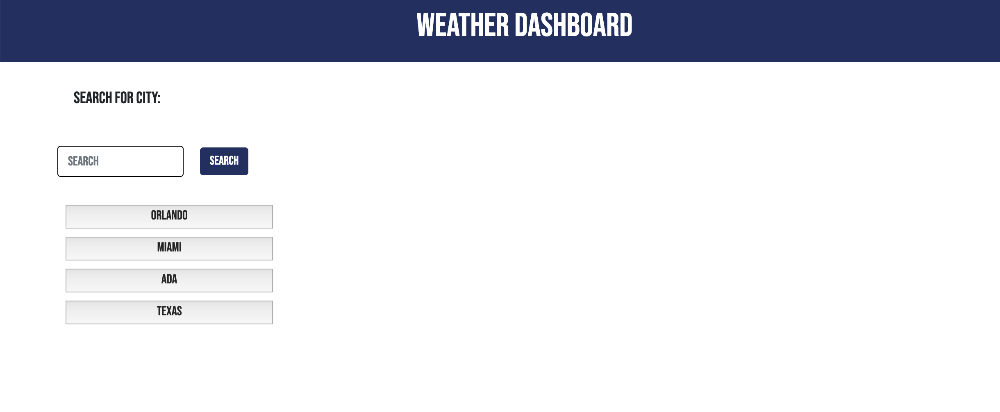

# Weather Dashboard


## Introduction
This simple Weather Dashboard will keep you inform. You just need to type the city and you will get temperature, winds, humidity and even UV! Cool, right? Wait, you also get to see 5 day forecast!


## Code 
```js
    // function that saves previous search
function history() {
    $(".historyButton").empty();
    let localArray = JSON.parse(localStorage.getItem("searchHistory"));
    console.log(localArray);
    
    if (localArray === null) {
        localArray = [];
    } 

    for (let index = 0; index < localArray.length; index++) {

        let newBtn =
        $("<button>").text(localArray[index]).addClass("historyBtn").attr("value",localArray[index]);
        $(".historyButton").append(newBtn)
        
        
    }
}
```

## Technologies
* HTML
* CSS
* Bootstrap
* JS
* JQuery
* Moment JS
* API (https://openweathermap.org/api)

## Instalation
1. On GitHub, navigate to the main page of the repository.
2. Under the repository name, click Clone or download.
3. To clone the repository, click "Clone with HTTPS".
4. Open Terminal.
5. Change the current working directory to the location where you want the cloned directory to be made.
6. Type git clone, and then paste the URL you copied in Step 2.
7. Press Enter. Your local clone will be created.

## Authors
* Lilliana Ramos

